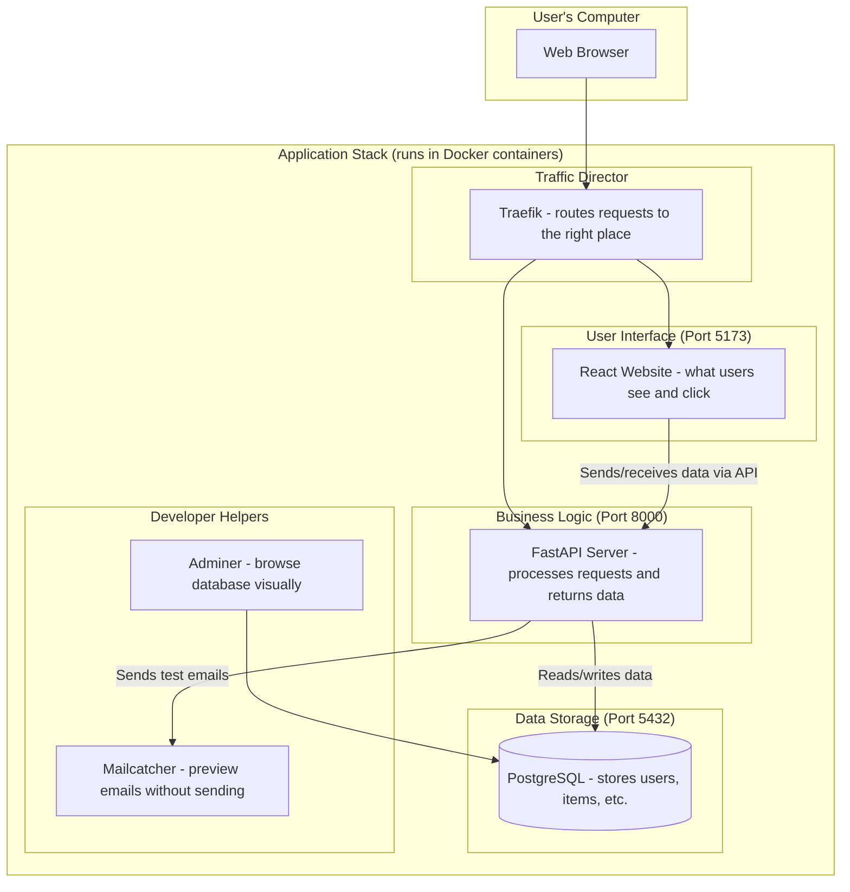
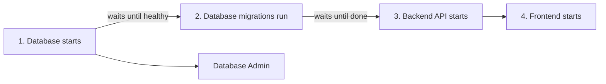
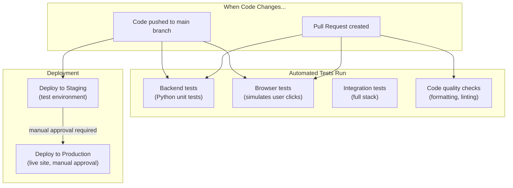

# Full Stack FastAPI Template - Repository Analysis

> **For readers:** This document explains the project architecture in plain terms. Technical details are included but explained, so you don't need to be a developer to understand the big picture.

## Table of Contents

1. [What Is This Project?](#what-is-this-project)
2. [How Everything Connects](#1-how-everything-connects-architecture-overview)
3. [Backend Structure](#2-backend-structure-the-server-side-code)
4. [Frontend Structure](#3-frontend-structure-the-user-interface)
5. [Code Patterns](#4-code-patterns-how-things-work)
6. [Services & How to Access Them](#5-services--how-to-access-them)
7. [Automated Testing & Deployment](#6-automated-testing--deployment-cicd)
8. [Quick Reference](#7-quick-reference)

---

## What Is This Project?

This is a **starter template** for building modern web applications. Think of it as a ready-made foundation that includes:

- A **website** that users interact with (the Frontend)
- A **server** that handles business logic and data (the Backend)
- A **database** that stores information (PostgreSQL)
- **Infrastructure** that ties everything together (Docker containers)

This template follows industry best practices, so teams can focus on building features instead of setting up basic architecture from scratch.

---

## 1. How Everything Connects (Architecture Overview)

The diagram below shows how the different parts of the application communicate with each other:



### Key Concepts Explained

| Term | What It Means |
|------|---------------|
| **Docker** | Software that packages the application into isolated "containers" that run the same way on any computer |
| **API** | Application Programming Interface - a set of rules that lets the frontend talk to the backend |
| **Port** | A numbered doorway on a computer (like Port 8000) where a service listens for requests |
| **REST API** | A standard way of designing APIs using web addresses (URLs) and actions (GET, POST, PUT, DELETE) |

---

## 2. Backend Structure (The Server-Side Code)

The backend is the "brain" of the application. It handles user authentication, stores data, and enforces business rules. Here's how the files are organized:

```
backend/app/
├── main.py                 # Starting point - launches the server
├── models.py               # Defines data structures (User, Item, etc.)
├── crud.py                 # Create, Read, Update, Delete operations
├── utils.py                # Helper functions (like sending emails)
├── api/
│   ├── main.py             # Collects all API routes in one place
│   ├── deps.py             # Shared code used by multiple routes
│   └── routes/
│       ├── login.py        # Login and authentication
│       ├── users.py        # User management (create, edit, delete users)
│       ├── items.py        # Item management (your app's main data)
│       ├── utils.py        # Health checks and utility endpoints
│       └── private.py      # Developer-only debugging routes
├── core/
│   ├── config.py           # Application settings (from environment variables)
│   ├── db.py               # Database connection setup
│   └── security.py         # Password hashing and login tokens
└── alembic/
    └── versions/           # Database structure change history
```

### What Each Key File Does

| File | Purpose | Why It Matters |
|------|---------|----------------|
| `main.py` | Starts the FastAPI server | The entry point - run this to start the backend |
| `models.py` | Defines User and Item data structures | Determines what data your app can store |
| `crud.py` | Database operations | How data gets created, fetched, updated, deleted |
| `api/deps.py` | Shared dependencies | Handles authentication and database connections for all routes |
| `core/security.py` | Security functions | Keeps passwords safe and manages login sessions |

### Terms You'll See

| Term | Meaning |
|------|---------|
| **CRUD** | Create, Read, Update, Delete - the four basic database operations |
| **ORM** | Object-Relational Mapping - lets you work with database tables as Python objects |
| **JWT** | JSON Web Token - a secure way to verify logged-in users |
| **Migration** | A controlled change to the database structure |

---

## 3. Frontend Structure (The User Interface)

The frontend is what users actually see and interact with in their browser. It's built with React, a popular JavaScript library for building user interfaces.

```
frontend/src/
├── main.tsx                # Starting point - loads the React app
├── routeTree.gen.ts        # Auto-generated navigation map
├── routes/                 # Each file = a page in the app
│   ├── __root.tsx          # Main wrapper for the entire app
│   ├── _layout.tsx         # Wrapper for pages that need login
│   ├── _layout/
│   │   ├── index.tsx       # Dashboard home page (/)
│   │   ├── items.tsx       # Items management page (/items)
│   │   ├── admin.tsx       # Admin panel for managing users (/admin)
│   │   └── settings.tsx    # User profile settings (/settings)
│   ├── login.tsx           # Login page
│   ├── signup.tsx          # New user registration
│   ├── recover-password.tsx
│   └── reset-password.tsx
├── components/             # Reusable UI building blocks
│   ├── Admin/              # Components for user management
│   ├── Items/              # Components for item management
│   ├── UserSettings/       # Profile settings forms
│   ├── Sidebar/            # Navigation menu on the side
│   ├── Common/             # Shared utilities (tables, layouts)
│   └── ui/                 # Basic UI elements (buttons, inputs, etc.)
├── client/                 # Auto-generated code for talking to backend
│   ├── sdk.gen.ts          # Functions to call API endpoints
│   ├── types.gen.ts        # Data type definitions
│   └── core/               # HTTP request handling
├── hooks/                  # Reusable logic
│   ├── useAuth.ts          # Login/logout functionality
│   ├── useCustomToast.ts   # Pop-up notifications
│   └── useMobile.ts        # Detect mobile vs desktop
└── lib/
    └── utils.ts            # Helper utilities
```

### How Navigation Works

The app uses **file-based routing** - the folder/file structure under `routes/` automatically becomes the URL structure:

| File Path | URL | Description |
|-----------|-----|-------------|
| `routes/login.tsx` | `/login` | Login page |
| `routes/_layout/index.tsx` | `/` | Dashboard (requires login) |
| `routes/_layout/items.tsx` | `/items` | Items page (requires login) |
| `routes/_layout/admin.tsx` | `/admin` | Admin panel (requires login) |

---

## 4. Code Patterns (How Things Work)

This section shows the coding patterns used in this project. Even if you don't understand every line, the explanations will help you grasp the concepts.

### 4.1 How the Backend Handles Requests

When a user wants to see their items, here's what happens behind the scenes:

```python
# This creates a group of related endpoints under /api/v1/items
router = APIRouter(prefix="/items", tags=["items"])

# GET /api/v1/items - Fetch a list of items
@router.get("/", response_model=ItemsPublic)
def read_items(
    session: SessionDep,           # Database connection (auto-provided)
    current_user: CurrentUser,     # Logged-in user info (auto-verified)
    skip: int = 0,                 # How many items to skip (for pagination)
    limit: int = 100               # Maximum items to return
) -> Any:
    # Admin users see ALL items; regular users only see their OWN
    if current_user.is_superuser:
        statement = select(Item).offset(skip).limit(limit)
    else:
        statement = select(Item).where(Item.owner_id == current_user.id)
    items = session.exec(statement).all()
    return ItemsPublic(data=items, count=count)

# POST /api/v1/items - Create a new item
@router.post("/", response_model=ItemPublic)
def create_item(session: SessionDep, current_user: CurrentUser, item_in: ItemCreate):
    # Automatically assign the item to whoever created it
    item = Item.model_validate(item_in, update={"owner_id": current_user.id})
    session.add(item)      # Add to database
    session.commit()       # Save changes
    return item
```

**Key Takeaway:** The backend automatically handles database connections and user authentication. Developers just write the business logic.

---

### 4.2 How the Frontend Displays Pages

Here's how a page loads and displays data:

```typescript
// This tells the router: "When someone visits /items, show this page"
export const Route = createFileRoute("/_layout/items")({
  component: Items,
  head: () => ({ meta: [{ title: "Items - FastAPI Cloud" }] }),
})

// This component fetches data from the backend
function ItemsTableContent() {
  // Automatically fetches items and re-fetches when data changes
  const { data: items } = useSuspenseQuery({
    queryFn: () => ItemsService.readItems({ skip: 0, limit: 100 }),
    queryKey: ["items"],  // Cache key - used to know when to refresh
  })
  return <DataTable columns={columns} data={items.data} />
}

// This shows a loading indicator while data is being fetched
function Items() {
  return (
    <Suspense fallback={<PendingItems />}>
      <ItemsTableContent />
    </Suspense>
  )
}
```

**Key Takeaway:** The frontend handles loading states and data caching automatically. Developers focus on what to display.

---

### 4.3 How Login Security Works

This is how the system verifies users are logged in:

```python
# Every request must include a valid token in the header
reusable_oauth2 = OAuth2PasswordBearer(tokenUrl=f"{settings.API_V1_STR}/login/access-token")

# This function runs on every request to protected routes
def get_current_user(session: SessionDep, token: TokenDep) -> User:
    # 1. Decode the token to get the user ID
    payload = jwt.decode(token, settings.SECRET_KEY, algorithms=[ALGORITHM])
    token_data = TokenPayload(**payload)

    # 2. Look up the user in the database
    user = session.get(User, token_data.sub)

    # 3. Reject if user not found or deactivated
    if not user or not user.is_active:
        raise HTTPException(status_code=403)
    return user

# Shortcut: just add "current_user: CurrentUser" to any route to require login
CurrentUser = Annotated[User, Depends(get_current_user)]

# For admin-only routes, add this extra check
def get_current_active_superuser(current_user: CurrentUser) -> User:
    if not current_user.is_superuser:
        raise HTTPException(status_code=403, detail="Not enough privileges")
    return current_user
```

**Key Takeaway:** Security is handled centrally. Adding `CurrentUser` to any endpoint automatically requires login.

---

## 5. Services & How to Access Them

When you run the application with Docker, several services start up. Here's what each one does and how to access it.

### Local Development (Your Computer)

| Service | URL/Port | What It Does |
|---------|----------|--------------|
| **Frontend** | http://localhost:5173 | The website you interact with |
| **Backend API** | http://localhost:8000 | The server that processes requests |
| **API Documentation** | http://localhost:8000/docs | Interactive API explorer (try endpoints here!) |
| **Database Admin** | http://localhost:8080 | Visual tool to browse database tables |
| **Email Preview** | http://localhost:1080 | See emails the app would send (without actually sending) |
| **Database** | localhost:5432 | PostgreSQL database (for direct database tools) |

### Production (Live Server)

In production, URLs are based on your domain name:

| Service | URL | What It Does |
|---------|-----|--------------|
| **Frontend** | `dashboard.yourdomain.com` | The live website |
| **Backend API** | `api.yourdomain.com` | The live API server |
| **Database Admin** | `adminer.yourdomain.com` | Database browser (password protected) |

### How Services Start Up

The services must start in a specific order to work correctly:



This ensures the database is ready before the backend tries to connect to it.

---

## 6. Automated Testing & Deployment (CI/CD)

When developers push code changes, automated workflows run tests and deploy the application. This ensures code quality and catches bugs before they reach users.

### What Happens When Code Changes



### What Each Automated Check Does

| Check | When It Runs | What It Verifies |
|-------|--------------|------------------|
| **Backend Tests** | Every code change | Python functions work correctly (90% code coverage required) |
| **Browser Tests** | Every code change | Users can log in, create items, etc. (tests actual clicks) |
| **Integration Tests** | Every code change | All services work together properly |
| **Code Quality** | Pull requests | Code is formatted consistently, no obvious errors |
| **Staging Deploy** | Push to main | New features work on test server before going live |
| **Production Deploy** | Manual trigger | Approved changes go to the live website |

### The Testing Process (Step by Step)

**Backend Tests:**
1. Download the code
2. Set up Python environment
3. Start a test database
4. Run all the automated tests
5. Check that at least 90% of code is tested
6. If anything fails, the whole check fails

**Browser Tests:**
1. Build the entire application
2. Open it in an automated browser
3. Click through key user flows (login, create items, etc.)
4. Run 4 copies in parallel for speed
5. Generate a visual report of results

**Deployment:**
1. Build new Docker images with latest code
2. Replace old containers with new ones
3. Automatic HTTPS certificates are handled

### Key Terms

| Term | Meaning |
|------|---------|
| **CI/CD** | Continuous Integration / Continuous Deployment - automating tests and releases |
| **Pipeline** | A series of automated steps that run when code changes |
| **Staging** | A test version of the live site for final verification |
| **Coverage** | The percentage of code that automated tests check |

---

## 7. Quick Reference

### At a Glance

| Aspect | Technology | Purpose |
|--------|------------|---------|
| **Frontend** | React + TypeScript | User interface (what users see) |
| **Backend** | Python + FastAPI | Business logic and API |
| **Database** | PostgreSQL | Data storage |
| **Containers** | Docker | Consistent deployment |
| **Web Server** | Traefik | Routes traffic, handles HTTPS |

### Getting Started (For Developers)

```bash
# Start the entire application locally
docker compose watch

# Then visit:
# - http://localhost:5173     (website)
# - http://localhost:8000/docs (API docs)
```

### Glossary of All Terms

| Term | Simple Explanation |
|------|-------------------|
| **API** | A way for programs to talk to each other over the internet |
| **Backend** | The server-side code that users don't see directly |
| **CI/CD** | Automatic testing and deployment when code changes |
| **Container** | A packaged application that runs the same on any computer |
| **CRUD** | Create, Read, Update, Delete - basic data operations |
| **Database** | Where all the data is permanently stored |
| **Docker** | Software that creates and runs containers |
| **Endpoint** | A specific URL that the API responds to |
| **Frontend** | The user interface that runs in the browser |
| **JWT** | A secure token that proves you're logged in |
| **Migration** | A versioned change to the database structure |
| **ORM** | Lets you use Python objects instead of writing database queries |
| **Pipeline** | A series of automated steps (tests, builds, deployments) |
| **Port** | A numbered address where a service listens for connections |
| **REST** | A standard pattern for designing web APIs |
| **Staging** | A test environment that mirrors production |
| **Token** | A secret key that proves your identity |

---

*Last updated: Generated from project analysis*
