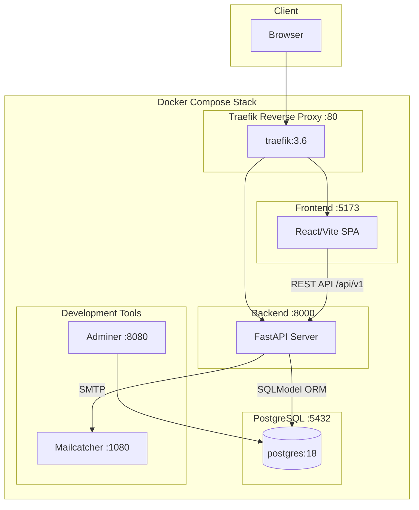
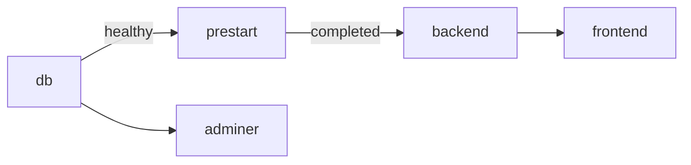
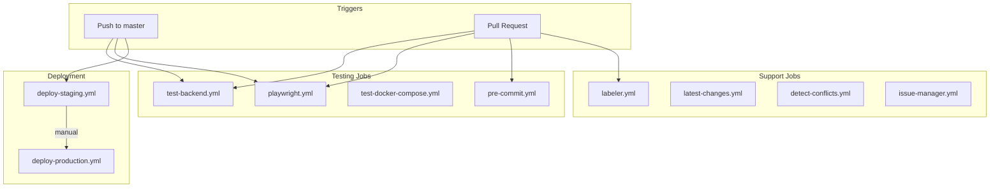

# Full Stack FastAPI Template - Repository Analysis

## 1. Architecture Overview



## 2. Backend Structure (`backend/app/`)

```
backend/app/
├── main.py                 # FastAPI app entry, CORS, router setup
├── models.py               # SQLModel ORM models (User, Item, Token)
├── crud.py                 # CRUD operations (create_user, authenticate)
├── utils.py                # Email utilities
├── api/
│   ├── main.py             # Router aggregation (login, users, items, utils)
│   ├── deps.py             # Dependency injection (SessionDep, CurrentUser)
│   └── routes/
│       ├── login.py        # Auth endpoints (/login/access-token)
│       ├── users.py        # User CRUD (/users)
│       ├── items.py        # Item CRUD (/items)
│       ├── utils.py        # Health check, test email
│       └── private.py      # Local-only debug routes
├── core/
│   ├── config.py           # Pydantic Settings (env vars)
│   ├── db.py               # SQLAlchemy engine setup
│   └── security.py         # JWT creation, password hashing
└── alembic/
    └── versions/           # Database migrations
```

### Key Files

| File | Purpose |
|------|---------|
| `main.py:17-21` | FastAPI app initialization with OpenAPI config |
| `models.py` | SQLModel classes for User, Item with relationships |
| `api/deps.py:26` | `SessionDep` - DB session injection |
| `api/deps.py:49` | `CurrentUser` - JWT token extraction |
| `api/main.py:6-14` | Router includes for all API routes |

## 3. Frontend Structure (`frontend/src/`)

```
frontend/src/
├── main.tsx                # React entry point
├── routeTree.gen.ts        # Auto-generated routes (TanStack Router)
├── routes/
│   ├── __root.tsx          # Root layout with providers
│   ├── _layout.tsx         # Authenticated layout with sidebar
│   ├── _layout/
│   │   ├── index.tsx       # Dashboard home (/)
│   │   ├── items.tsx       # Items management (/items)
│   │   ├── admin.tsx       # User admin (/admin)
│   │   └── settings.tsx    # User settings (/settings)
│   ├── login.tsx           # Login page
│   ├── signup.tsx          # Registration page
│   ├── recover-password.tsx
│   └── reset-password.tsx
├── components/
│   ├── Admin/              # User management (AddUser, EditUser, DeleteUser)
│   ├── Items/              # Item management (AddItem, EditItem, DeleteItem)
│   ├── UserSettings/       # Profile settings
│   ├── Sidebar/            # Navigation sidebar
│   ├── Common/             # Shared components (DataTable, AuthLayout)
│   └── ui/                 # shadcn/ui primitives
├── client/                 # Auto-generated API client (OpenAPI)
│   ├── sdk.gen.ts          # Service methods
│   ├── types.gen.ts        # TypeScript types
│   └── core/               # HTTP request utilities
├── hooks/
│   ├── useAuth.ts          # Auth state management
│   ├── useCustomToast.ts   # Toast notifications
│   └── useMobile.ts        # Responsive detection
└── lib/
    └── utils.ts            # Tailwind cn() helper
```

## 4. Key Patterns

### 4.1 Backend CRUD Pattern (`api/routes/items.py`)

```python
# Route definition with prefix and tags
router = APIRouter(prefix="/items", tags=["items"])

# Dependency injection pattern
@router.get("/", response_model=ItemsPublic)
def read_items(
    session: SessionDep,           # DB session injected
    current_user: CurrentUser,     # JWT user extracted
    skip: int = 0,
    limit: int = 100
) -> Any:
    # Superuser sees all, regular user sees own
    if current_user.is_superuser:
        statement = select(Item).offset(skip).limit(limit)
    else:
        statement = select(Item).where(Item.owner_id == current_user.id)
    items = session.exec(statement).all()
    return ItemsPublic(data=items, count=count)

# Create with ownership assignment
@router.post("/", response_model=ItemPublic)
def create_item(session: SessionDep, current_user: CurrentUser, item_in: ItemCreate):
    item = Item.model_validate(item_in, update={"owner_id": current_user.id})
    session.add(item)
    session.commit()
    return item
```

### 4.2 Frontend Page Pattern (`routes/_layout/items.tsx`)

```typescript
// TanStack Router file-based route
export const Route = createFileRoute("/_layout/items")({
  component: Items,
  head: () => ({ meta: [{ title: "Items - FastAPI Cloud" }] }),
})

// TanStack Query for data fetching
function ItemsTableContent() {
  const { data: items } = useSuspenseQuery({
    queryFn: () => ItemsService.readItems({ skip: 0, limit: 100 }),
    queryKey: ["items"],
  })
  return <DataTable columns={columns} data={items.data} />
}

// Suspense for loading states
function Items() {
  return (
    <Suspense fallback={<PendingItems />}>
      <ItemsTableContent />
    </Suspense>
  )
}
```

### 4.3 Authentication Pattern (`api/deps.py`)

```python
# OAuth2 bearer token scheme
reusable_oauth2 = OAuth2PasswordBearer(tokenUrl=f"{settings.API_V1_STR}/login/access-token")

# Current user extraction dependency
def get_current_user(session: SessionDep, token: TokenDep) -> User:
    payload = jwt.decode(token, settings.SECRET_KEY, algorithms=[ALGORITHM])
    token_data = TokenPayload(**payload)
    user = session.get(User, token_data.sub)
    if not user or not user.is_active:
        raise HTTPException(status_code=403)
    return user

# Type aliases for dependency injection
CurrentUser = Annotated[User, Depends(get_current_user)]

# Superuser guard
def get_current_active_superuser(current_user: CurrentUser) -> User:
    if not current_user.is_superuser:
        raise HTTPException(status_code=403, detail="Not enough privileges")
    return current_user
```

## 5. Docker Services & Ports

### compose.override.yml (Local Development)

| Service | Port | Description |
|---------|------|-------------|
| `proxy` | 80, 8090 | Traefik reverse proxy + dashboard |
| `db` | 5432 | PostgreSQL 18 |
| `backend` | 8000 | FastAPI with hot reload |
| `frontend` | 5173 | Vite dev server (via nginx) |
| `adminer` | 8080 | Database admin UI |
| `mailcatcher` | 1080, 1025 | SMTP mock + web UI |
| `playwright` | 9323 | E2E test runner |

### compose.yml (Production)

| Service | Traefik Route | Description |
|---------|---------------|-------------|
| `backend` | `api.${DOMAIN}` | FastAPI behind HTTPS |
| `frontend` | `dashboard.${DOMAIN}` | React SPA |
| `adminer` | `adminer.${DOMAIN}` | DB admin (secured) |
| `prestart` | - | Runs migrations before backend |

### Service Startup Order



## 6. CI/CD Workflows

### Pipeline Overview



### Workflow Details

| Workflow | Trigger | Purpose |
|----------|---------|---------|
| `test-backend.yml` | push, PR | pytest + coverage (90% min) |
| `playwright.yml` | push, PR | E2E tests (4 shards parallel) |
| `test-docker-compose.yml` | push, PR | Full stack integration test |
| `pre-commit.yml` | PR | Linting (ruff, biome) |
| `deploy-staging.yml` | push to master | Auto-deploy to staging |
| `deploy-production.yml` | manual | Production deployment |

### test-backend.yml Flow

```
1. Checkout code
2. Setup Python 3.10 + uv
3. Start db + mailcatcher containers
4. Run migrations (scripts/prestart.sh)
5. Run pytest with coverage
6. Upload coverage artifacts
7. Fail if coverage < 90%
```

### playwright.yml Flow

```
1. Check for changes in backend/frontend
2. Run 4 parallel shards:
   - Build docker compose stack
   - Run Playwright tests per shard
   - Upload blob reports
3. Merge all shard reports into HTML
4. Upload final HTML report
```

### Deployment Flow

```
1. Self-hosted runner (staging/production)
2. Build docker images
3. docker compose up -d
4. Traefik handles SSL via Let's Encrypt
```
